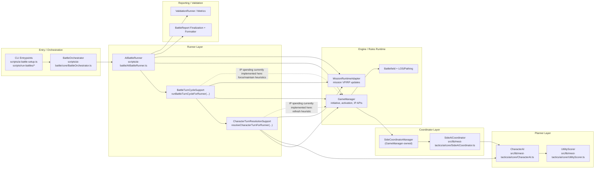
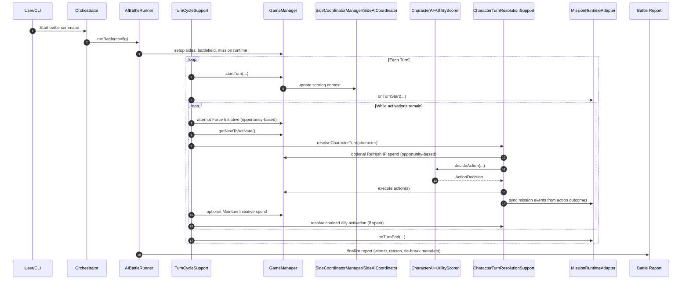

# AI Battle Architecture

This document focuses on the runtime architecture in terms of:

- Planner
- Coordinator
- Runner
- Orchestrator

It also shows where Initiative Point (IP) spending is currently decided.

## 1) Components / Facilities

## 2) Sequence (Turn / Activation)

## 3) Flow Notes

1. Orchestrator and CLI launch the canonical runner.
2. Runner owns battle setup, controller creation, and final report assembly.
3. Turn cycle owns queue-level orchestration and executes coordinator-issued `forceInitiative` + `maintainInitiative` decisions.
4. Character turn resolution owns per-model activation and executes coordinator-issued `refresh` decisions.
5. Planner (`CharacterAI` + `UtilityScorer`) selects actions for an active model, influenced by coordinator context.
6. Coordinator (`SideAICoordinator`) updates side strategy context each turn and exposes turn signals via `getInitiativeSignalForTurn(...)`; runner IP heuristics consume those signals before force/maintain/refresh spending.
7. Engine (`GameManager`) is the authority that executes IP spend APIs and activation order effects.

## 4) Current IP Ownership (Important)

As of now:

- `forceInitiative` policy is owned by `SideAICoordinator` (`recommendForceInitiativeSpend`), executed in runner turn orchestration.
- `maintainInitiative` policy is owned by `SideAICoordinator` (`recommendMaintainInitiativeSpend`), executed in runner turn orchestration.
- `refresh` policy is owned by `SideAICoordinator` (`recommendRefreshInitiativeSpend`), executed in character turn resolution.
- Runner-layer fallback heuristics are only used when coordinator decision APIs are unavailable.
